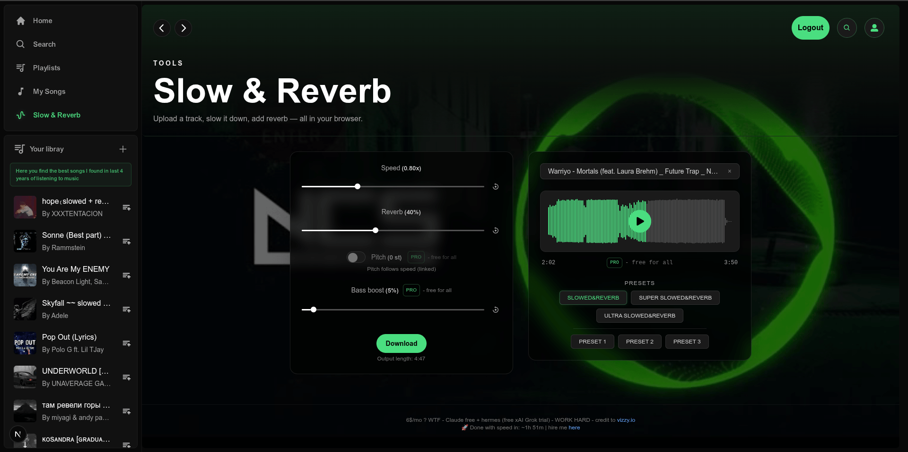

# dev_readme — Slow & Reverb

> A standalone `/slow-and-reverb` tool that turns any local audio file into a
> "slowed + reverb" edit **entirely in the browser** — no upload, no server, no
> DB. Everything below reflects the code in this folder as it actually is.

---

## 0. Why this exists (in plain words)

People make `slowed + reverb` edits of songs constantly.
**Problem:** The usual options is awebsite that:

1. upload your file to some server
2. has bad UI/UX
3. ask you for money

So drop in an MP3, drag the sliders (Speed / Reverb / Pitch / Bass),
hit a preset, watch a live waveform, and download a 320 kbps MP3 of the result.

Key constraint that shaped everything: **it must never touch the global player or
any backend.** The file stays on the user's machine. All processing is the Web
Audio API. That's why there is no Redis / Supabase / zustand in this feature —
see §1.3.

---

## 1. How does it look like?



### 1.1 UI components

| What you see in the image                                        | Component (file)                                                                                                                             |
| ---------------------------------------------------------------- | -------------------------------------------------------------------------------------------------------------------------------------------- |
| The whole page shell + Header + footer                           | [page.tsx](./page.tsx)                                                                                                                       |
| Everything inside (state owner, 2-column layout)                 | [components/SlowReverbEditor.tsx](./components/SlowReverbEditor.tsx)                                                                         |
| Green audio-reactive **background** (from the track's cover art) | [components/AlbumArt.tsx](./components/AlbumArt.tsx)                                                                                         |
| **Left panel** — Speed / Reverb / Pitch / Bass rows              | [components/EffectSliderRow.tsx](./components/EffectSliderRow.tsx), [components/PitchToggleRow.tsx](./components/PitchToggleRow.tsx)         |
| The range input inside each row                                  | [components/Slider.tsx](../../../components/Slider.tsx) (shared, extended)                                                                   |
| `PRO` chip next to Pitch / Bass                                  | [components/ProBadge.tsx](./components/ProBadge.tsx)                                                                                         |
| Download button + "Output length"                                | [components/DownloadButton.tsx](./components/DownloadButton.tsx)                                                                             |
| **Right panel** — filename pill, waveform, presets               | [components/SlowReverbEditor.tsx](./components/SlowReverbEditor.tsx)                                                                         |
| The canvas waveform + play button + time row                     | [components/Waveform.tsx](./components/Waveform.tsx)                                                                                         |
| Empty state (before upload): dropzone + 4-step guide             | [components/FileDropZone.tsx](./components/FileDropZone.tsx), [components/FullScreenDropOverlay.tsx](./components/FullScreenDropOverlay.tsx) |

### UI logic / engine files (no visible DOM of their own)

| Concern                                                    | File                                                           |
| ---------------------------------------------------------- | -------------------------------------------------------------- |
| The audio engine (state, playback, seek, params, download) | [hooks/useSlowReverbEngine.ts](./hooks/useSlowReverbEngine.ts) |
| Full-window drag detection for the empty state             | [hooks/useDocumentDrag.ts](./hooks/useDocumentDrag.ts)         |
| The Web Audio graph builder (live **and** offline)         | [lib/buildEffectsGraph.ts](./lib/buildEffectsGraph.ts)         |
| Granular pitch shifter (transpose independent of speed)    | [lib/pitchShifter.ts](./lib/pitchShifter.ts)                   |
| Generated reverb impulse response (2.5 s noise decay)      | [lib/impulseResponse.ts](./lib/impulseResponse.ts)             |
| Offline render for export (`OfflineAudioContext`)          | [lib/renderOffline.ts](./lib/renderOffline.ts)                 |
| MP3 encode via `@breezystack/lamejs`, 320 kbps, chunked    | [lib/encodeMp3.ts](./lib/encodeMp3.ts)                         |
| Extract embedded cover art from MP3 ID3 `APIC`             | [lib/id3AlbumArt.ts](./lib/id3AlbumArt.ts)                     |
| `formatTime(sec)` → `m:ss`                                 | [lib/format.ts](./lib/format.ts)                               |

### 1.2 Types + file pathname

The single source of truth for state is the hook's return interface —
[hooks/useSlowReverbEngine.ts](./hooks/useSlowReverbEngine.ts):

```ts
// hooks/useSlowReverbEngine.ts
export interface PresetValues {
  speed: number // 0.5 .. 1.5
  reverb: number // 0 .. 100 (%)
  bass: number // 0 .. 100 (%)
  pitchSt: number // -12 .. +12 semitones (0 = pitch disabled)
}

export interface SlowReverbEngine {
  loadFile(file: File): Promise<void>
  fileName: string | null
  buffer: AudioBuffer | null
  duration: number // ORIGINAL track seconds
  isPlaying: boolean
  getPosition(): number // live playhead seconds (not React state)
  togglePlay(): void
  seek(seconds: number): void
  speed: number
  setSpeed(v: number): void
  reverb: number
  setReverb(v: number): void
  bass: number
  setBass(v: number): void
  pitchSemitones: number
  setPitchSemitones(v: number): void
  pitchEnabled: boolean
  setPitchEnabled(v: boolean): void
  applyPreset(values: PresetValues): void
  isRendering: boolean
  download(): Promise<void>
  clear(): void
  albumArtUrl: string | null // object URL of embedded cover, or null
  getKickLevel(): number // 0..1 kick/808 onset strength (bg reactivity); see lib/kickDetector.ts
}
```

The graph builder — [lib/buildEffectsGraph.ts](./lib/buildEffectsGraph.ts):

```ts
// lib/buildEffectsGraph.ts
export interface EffectsParams {
  speed: number
  reverb: number // 0-100
  bass: number // 0-100
  pitchSemitones: number // -12..+12, on TOP of speed's natural pitch shift
  pitchEnabled: boolean
}
export function semitonesToRatio(semitones: number): number // 2 ** (st / 12)
```

The pitch shifter — [lib/pitchShifter.ts](./lib/pitchShifter.ts):

```ts
// lib/pitchShifter.ts
export interface PitchShifter {
  input: GainNode
  output: GainNode
  setRatio(ratio: number, time: number): void // 0.5 .. 2.0 (clamped)
}
```

### 1.3 Where the data lives — ASCII data-flow tree

**There is no external store.** No Redis, no Supabase, no zustand. This is a
deliberate design decision (see §4). State is 100% page-local React state/refs,
and the audio itself lives in the browser's Web Audio graph in memory.

```
User's local file (File object — never leaves the browser)
   │
   │  loadFile(file)
   ▼
useSlowReverbEngine.ts  ── all state lives here ──────────────────────────────┐
   │                                                                          │
   ├─ React useState  (drives re-renders → the UI you see)                    │
   │     fileName, buffer, duration, isPlaying, speed, reverb, bass,          │
   │     pitchSemitones, pitchEnabled, isRendering, albumArtUrl               │
   │                                                                          │
   ├─ React useRef    (hot values read at 60fps WITHOUT re-rendering)         │
   │     ctxRef (AudioContext), sourceRef (AudioBufferSourceNode),            │
   │     lowshelfRef, wetGainRef, dryGainRef, pitchShifterRef, analyserRef,   │
   │     generationRef, pausedOffsetSecRef, startCtxTimeRef, *Ref mirrors     │
   │                                                                          │
   └─ Web Audio graph  (the actual sound, in AudioContext memory)            │
         buildEffectsGraph() wires:                                           │
            AudioBufferSourceNode → pitchShifter → lowshelf(bass)             │
                → dry ─────────────┐                                          │
                → convolver(reverb) → wet ─┴→ destination (speakers)          │
            source → lowpass×2(120Hz) → kickAnalyser (tap, getKickLevel)      │
                                                                              │
   returns SlowReverbEngine ───────────────────────────────────────────────┘
   │
   ▼
SlowReverbEditor.tsx  (destructures the engine, lays out the two panels)
   │
   ├─ AlbumArt        ← albumArtUrl, pitchEnabled, pitchSemitones, isPlaying, getKickLevel
   ├─ Waveform        ← buffer, duration, isPlaying, getPosition, onSeek, onTogglePlay
   ├─ EffectSliderRow ← speed/reverb/bass  + set*
   ├─ PitchToggleRow  ← pitchSemitones, pitchEnabled + set*
   └─ DownloadButton  ← download, isRendering

Download path (separate, transient — no persisted state):
   download() → renderOffline(OfflineAudioContext, same graph)
             → encodeMp3(320 kbps, chunked) → Blob → <a download> → revoke
```

Cross-page: [page.tsx](./page.tsx) sets a CSS variable `--srv-bg` on
`document.documentElement` (via a `useEffect` in `SlowReverbEditor`) so the whole
page shell dims/brightens with pitch. That variable is the only thing that
escapes the component subtree, and it's removed on unmount.

### 1.4 Screenshots of "how data looks in each store"

**Not applicable.** There is no Redis / Supabase / EasyBase store to screenshot —
all data is in-memory React state and Web Audio nodes (see §1.3). The equivalent
"inspect the data" views are:

- **React state:** React DevTools → the `SlowReverbEditor` hook (`useSlowReverbEngine`).
- **The audio graph:** Chrome DevTools → the **Web Audio** panel (`chrome://media-internals`
  / the Web Audio tab) shows the live node graph and the `AudioContext`.
- **The decoded audio:** it's the `AudioBuffer` held in `bufferRef` — inspectable
  by logging `buffer.duration`, `buffer.numberOfChannels`, `buffer.sampleRate`.

If this feature ever needed persistence, this is the section that would grow a
Supabase/Redis screenshot. Today it intentionally has none.

---

## 2. Terminology

| Term                      | Meaning here                                                                                                                                                                                              |
| ------------------------- | --------------------------------------------------------------------------------------------------------------------------------------------------------------------------------------------------------- |
| **Speed**                 | `AudioBufferSourceNode.playbackRate`. Changes tempo **and** natural pitch together (the classic "slowed" sound). Range 0.5–1.5.                                                                           |
| **Pitch** (semitones)     | An **independent** transposition on top of speed, done by the granular shifter. `-12..+12` st; `2^(st/12)` = ratio. FL-Studio mental model: "play C5 content as C4" = `-12`. `0` = disabled (dry bypass). |
| **Reverb**                | Wet/dry mix (0–100%) into a `ConvolverNode` fed by a generated 2.5 s decaying-noise impulse response.                                                                                                     |
| **Bass boost**            | `BiquadFilterNode` `lowshelf` at 200 Hz; `gain = bass/100 * 12` dB.                                                                                                                                       |
| **Preset**                | A `PresetValues` bundle applied to all four controls at once. Six of them (see §3).                                                                                                                       |
| **Position / playhead**   | Seconds into the **original** track. Because sources are one-shot, it's computed from an anchor, not read from a node.                                                                                    |
| **Anchor**                | `{ startCtxTimeRef, startOffsetSecRef }`. `position = startOffset + (ctx.currentTime - startCtxTime) * speed`.                                                                                            |
| **Generation**            | `generationRef` counter. A one-shot source's `onended` compares its captured generation to the current one to tell a **natural end** from a **manual stop**.                                              |
| **Kick reactivity**       | A passive tap `source → lowpass×2(120 Hz) → kickAnalyser` (pre-effects, so hats/claps/vocals are filtered out before measurement). `getKickLevel()` takes the tap's time-domain RMS and `lib/kickDetector.ts` flags an onset when it spikes above the track's own recent average (energy-relative → song-independent). The background scales/blurs on those onsets = kicks/808s. |
| **IR (impulse response)** | The reverb "room". Synthesized noise with exponential decay — no asset file.                                                                                                                              |
| **Offline render**        | `OfflineAudioContext` re-runs the _same_ graph faster-than-realtime to produce the downloadable buffer.                                                                                                   |

---

## 3. How it works — ASCII walkthroughs

### 3.1 The signal graph (live and offline are identical)

```
                                   ┌────────────► dryGain ─────────┐
AudioBufferSource ─► pitchShifter ─► lowshelf ─┤                    ├─► destination
  │ (playbackRate=speed) (ratio)    (bass dB)  └─► convolver ─► wetGain ┘
  │                                                 (IR)     (reverb%)
  └─► lowpass×2 (120 Hz) ─► kickAnalyser   (passive tap only; getKickLevel)
```

- `buildEffectsGraph(ctx, buffer, params)` builds this for **both** the live
  `AudioContext` and the export `OfflineAudioContext`, so what you hear == what
  you download.
- Live param tweaks use `AudioParam.setTargetAtTime(v, now, 0.03)` — no graph
  rebuild, no zipper noise. Speed change re-anchors first, then ramps.

### 3.2 Play / pause / resume (one-shot source lifecycle)

`AudioBufferSourceNode` can't be paused — it's start-once, stop-once. So resume =
"stop, then start a new node at the saved offset".

```
PLAY  (from paused offset O):
   ctx.resume()
   ++generation
   playFromOffset(O):
      stopCurrent()                 // detaches old onended, stops old node
      build new graph
      startOffset = O ; startCtxTime = now
      source.onended = () => { if (gen stale) return; /* natural end */ pos=0 }
      source.start(0, O)

PAUSE:
   O = getPosition()                // anchor math, frozen
   pausedOffset = O
   stopCurrent()                    // ← nulls onended BEFORE stop (critical)
   isPlaying = false

SEEK(t):
   pausedOffset = t
   if playing → playFromOffset(t)   // audio jumps immediately
   Waveform also repaints itself right away (paused clicks move the playhead)
```

> **Critical rule** (learned the hard way, cf. `dev_readme-player.md`):
> `source.stop()` fires `onended` **asynchronously**. If `onended` still points
> at the natural-end handler, a _manual_ stop (pause/seek) will run the
> end-of-track path and reset the position to 0 → "it restarts from scratch".
> The fix: **null `source.onended` inside `stopCurrent()` before calling
> `stop()`.** Natural end is the only path left that runs the reset. See
> `stopCurrent` in [hooks/useSlowReverbEngine.ts](./hooks/useSlowReverbEngine.ts).

### 3.3 Position math (why there's no "currentTime" node)

```
while playing:
   position = startOffsetSec + (ctx.currentTime - startCtxTimeSec) * speed
while paused:
   position = pausedOffsetSec
```

`getPosition()` returns a number on demand (read by the waveform's rAF loop and
by pause), so the parent never re-renders at 60 fps.

### 3.4 The six presets (`SlowReverbEditor.tsx`)

```
── Row 1 (classic) ──────────────────────────────────────────
SLOWED&REVERB        speed 0.80  reverb 40%  pitch  0 st  bass  5%
SUPER SLOWED&REVERB  speed 0.70  reverb 40%  pitch  0 st  bass 10%
ULTRA SLOWED&REVERB  speed 0.60  reverb 40%  pitch  0 st  bass 20%
──────────────── separator ──────────────────────────────────
── Row 2 (custom, pitched down) ─────────────────────────────
PRESET 1             speed 0.85  reverb 60%  pitch -4 st  bass 20%
PRESET 2             speed 0.80  reverb 50%  pitch -6 st  bass 30%
PRESET 3             speed 0.75  reverb 40%  pitch -7 st  bass 35%
```

`applyPreset(values)` sets all four; `pitchSt !== 0` enables pitch, `=== 0`
disables it. A preset button highlights only when **all four values + the toggle
state** match current state.

### 3.5 Kick-reactive background (vizzy.io-style)

```
detection (engine, lib/kickDetector.ts): RMS of the 120Hz-lowpassed tap, compared
   to the track's own recent ~0.7s average → onset strength when it spikes (song-independent).

every animation frame (while playing):
   hit  = getKickLevel()                   // 0..1 onset strength (0 on non-kick frames)
   if hit > env:  env = hit                 // instant attack — snap to the hit
   env *= exp(-dt / DECAY_TAU_MS)           // time-based decay (frame-rate independent)
   background.scale  = REST_SCALE + env * KICK_RANGE   // 0.94 → 1.0, never above 1.0
   background.blur   = env * MAX_BLUR
on pause: 300 ms CSS transition eases scale/blur back to rest
```

Reacting to **flux** (the rise), not absolute level, is what makes it punch on
kicks instead of just swelling with loud/sustained bass. Ken-burns drift plays
on the `` (CSS, 15 s) only while playing + pitched down, composing under the
JS pulse on the wrapper. See [components/AlbumArt.tsx](./components/AlbumArt.tsx).

### 3.6 Download

```
download():
   params = current live values
   rendered = renderOffline(buffer, params)   // OfflineAudioContext, faster-than-RT
   blob     = encodeMp3(rendered, 320 kbps)   // chunked with setTimeout(0) yields
   <a download="Track (slowed …).mp3"> click → URL.revokeObjectURL
```

Output length shown in the UI = `duration / speed` (the reverb tail adds ~2.5 s
in the rendered file when reverb > 0).

---

## 4. TODO & decisions made AGAINST

### Open TODO

- [ ] **Verify pause→resume + seek by hand.** Repro: load MP3 → play → pause at
      ~40% → play (must continue from ~40%, not 0) → click elsewhere on the
      waveform (playhead must jump there, playing or paused) → let it play to the
      natural end (must reset to 0). All four are wired; confirm in-browser.
- [ ] **Tune bass reactivity per-genre.** Repro: play a kick-heavy track vs. an
      ambient one; adjust `FLUX_GAIN` / `FLUX_GATE` / `DECAY` in
      [AlbumArt.tsx](./components/AlbumArt.tsx) if it over/under-reacts.
- [ ] **Album art fallback.** Tracks with no embedded `APIC` frame → no
      background (just the pitch-dim color). Consider a default gradient.
- [ ] **Large-file guard.** `decodeAudioData` loads the whole file into memory.
      Very long/hi-res files could spike RAM; no size cap today.
- [ ] **Reduced-motion.** `@media (prefers-reduced-motion)` already kills the CSS
      ken-burns; confirm the JS bass pulse should also be gated (currently it
      isn't).

### Decisions made AGAINST (and why)

| We did NOT…                                    | Why                                                                                                                                                                                        |
| ---------------------------------------------- | ------------------------------------------------------------------------------------------------------------------------------------------------------------------------------------------ |
| …use Redis / Supabase / any backend            | The file never needs to leave the browser; adding a store would add upload latency, storage cost, and privacy risk for zero benefit. Everything is Web Audio in memory.                    |
| …put state in a zustand store                  | State is page-local and dies with the page. A global store would risk colliding with the app's real player (`usePlayer`) and the bottom `<Player />`. Plain `useState`/`useRef` is enough. |
| …touch the global `usePlayer` / bottom player  | This tool must not hijack or conflict with normal playback. It owns its own isolated `AudioContext`.                                                                                       |
| …use `use-sound`/Howler (like the main player) | Howler's `html5` streaming can't run a Web Audio effects graph (filters/convolver/pitch). We need raw `AudioBufferSourceNode` + nodes.                                                     |
| …use wavesurfer.js                             | We already decode to an `AudioBuffer` for effects; a ~100-line canvas peak renderer integrates better than fighting wavesurfer's own playback model.                                       |
| …offer WAV download                            | Kept the UI to one button: a single 320 kbps MP3. WAV added a dropdown and huge files for little gain.                                                                                     |
| …pause the source node                         | Web Audio one-shot sources genuinely can't pause/resume. The stop-and-restart-at-offset pattern (§3.2) is the correct, standard approach.                                                  |
| …drive the playhead from React state at 60fps  | Would re-render the whole editor every frame. Instead `getPosition()` is read imperatively inside the waveform's rAF loop.                                                                 |
| …bundle a reverb IR audio file                 | The IR is synthesized (noise + exponential decay) at runtime — no asset to ship or fetch.                                                                                                  |
| …use `next/image` for the background           | The cover is a runtime `blob:` object URL the Next image optimizer can't process; a plain `` with `object-cover` is simpler and correct.                                              |
| …react the background to bass **volume**       | Sustained bass would keep it permanently zoomed. We react to **onset (flux)** so it punches on kicks/808s instead.                                                                         |

```

```
